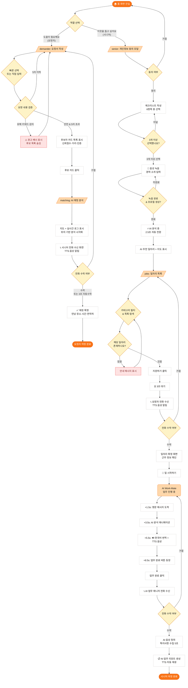

# SeeNear MVP — 프로젝트 분석 문서

> **작성 기준:** 코드베이스 전체 분석 (2026-02-22)  
> **작성자:** AI Architect (Antigravity)  
> **대상 저장소:** `howl-papa/SeeNear-MVP-Deploy`

---

## 1. 프로젝트 개요 (Project Overview)

### 비즈니스 목적

**SeeNear**는 시니어(Silver) 세대의 풍부한 생활 경험과 이웃 주민의 일상적 도움 수요를 연결하는 **AI 기반 하이퍼로컬(Hyper-Local) 돌봄 매칭 플랫폼**입니다. 기술 접근성이 낮은 시니어를 위해 음성 인식과 TTS(Text-to-Speech) 중심의 UX를 채택하여 텍스트 입력을 최소화하고, AI가 매칭·번역·리포트 업무를 자동화함으로써 시니어 사용자가 디지털 서비스의 가치를 쉽게 체험할 수 있도록 합니다.

이 애플리케이션은 **EY한영-JA Growth to Professional 2026** 경연대회 출품작 MVP(Minimum Viable Product)로, 실제 AI 백엔드 없이 브라우저 API와 Mock 데이터만으로 전체 서비스 시나리오를 시연 가능하도록 설계되었습니다.

### 핵심 기술 스택

| 영역 | 기술 |
|---|---|
| **프레임워크** | Next.js 16.1.6 (App Router, `"use client"` 선택적 적용) |
| **언어** | TypeScript 5 (Strict Mode) |
| **스타일링** | Tailwind CSS 4.0 (JIT, `tailwindcss-animate` 포함) |
| **상태 관리** | Zustand 5 (`src/lib/store.ts`) |
| **지도** | Leaflet 1.9.4 + React Leaflet 5 (`@/components/map-client`) |
| **음성 I/O** | Web Speech API (TTS: `SpeechSynthesisUtterance`), MediaRecorder API (녹음) |
| **아이콘** | Lucide React |
| **배포** | Vercel (GitHub `main` 브랜치 자동 배포) |

---

## 2. 주요 기능 명세 (Core Features)

### 모듈 1 · 역할 선택 & 홈

사용자가 처음 진입하면 **도움을 받고 싶은 요청자(Demander)** 또는 **일을 하고 싶은 시니어(Senior)** 두 가지 역할 중 하나를 선택합니다.

- **주요 파일:** `src/app/page.tsx`
- 브랜드 히어로 영역 + 두 개의 CTA 버튼 (요청자 / 선생님)
- 하단에 `/matching` 페이지로 연결되는 개발자용 숨김 링크 제공

---

### 모듈 2 · 시니어 온보딩 (`/senior`)

시니어가 서비스에 가입하고 AI가 적합한 일자리를 추천하는 전체 흐름을 4단계 인터랙티브 스텝으로 구현합니다.

- **주요 파일:** `src/app/senior/page.tsx`, `src/components/voice-recorder.tsx`, `src/hooks/use-voice-recorder.ts`, `src/lib/store.ts`

| 단계 | 화면 | 핵심 동작 |
|---|---|---|
| **Step 0** | 개인정보 동의 모달 | 음성·위치 정보 수집 동의. "아니오" 클릭 시 홈으로 리다이렉트 |
| **Step 1** | 체크리스트 | 6개 항목 중 최소 3개 선택해야 "다음" 버튼 활성화 |
| **Step 2** | 음성 녹음 | `VoiceRecorder` 컴포넌트로 경력 소개 녹음 → AI 자동 요약 생성 → Zustand `seniorProfile` 저장 |
| **Step 3** | 분석 중 | 2.5초 애니메이션 후 자동 전환 |
| **Step 4** | 일자리 추천 | Leaflet 지도 + 추천 일자리 카드 표시. `/jobs` 페이지로 이동 CTA |

**예외 처리:**
- 체크리스트 3개 미만 선택 → 다음 버튼 비활성(disabled)
- `seniorProfile`이 없는 상태에서 'analyzing' 단계 진입 → `return null` (화면 미렌더링)

---

### 모듈 3 · 요청자 매칭 (`/demander`)

도움이 필요한 요청자가 서비스 요청서를 작성하고, AI가 주변 시니어 후보를 보여주는 모듈입니다.

- **주요 파일:** `src/app/demander/page.tsx`

| 기능 | 설명 |
|---|---|
| **빠른 선택 (Quick Select)** | 가정지원 / 환경관리 / 사업보조 3개 카테고리, 9개 템플릿 버튼으로 요청문 자동 입력 |
| **요청 텍스트 입력** | Textarea에 직접 입력 가능. 5글자 초과 시 후보 목록 노출 |
| **유해 요청 필터** | `UNSAFE_KEYWORDS` 배열 기준 실시간 키워드 감지 → 위험 배지 표시 및 경고 메시지 출력, 후보 목록 숨김 |
| **후보자 카드** | Mock 데이터 3명, SeeNear 신뢰 점수(Tier: Master/Expert)·복지관 인증 배지·거리 표시 |
| **매칭 요청** | 후보 카드 클릭 → `/matching` 페이지로 라우팅 |

**예외 처리:**
- 요청 텍스트 5자 이하 → 후보 목록 미표시
- 유해 키워드 포함 → 후보 목록 숨김 + 경고 배너 표시

---

### 모듈 4 · AI 매칭 시각화 (`/matching`)

요청자가 매칭을 요청한 이후 AI가 분석하고 시니어와 전화를 연결하는 과정을 시각화합니다.

- **주요 파일:** `src/app/matching/page.tsx`, `src/components/map-client.tsx`

| 상태 | 화면 & 동작 |
|---|---|
| `analyzing` | Leaflet 지도 + 실시간 로그 텍스트 순차 출현 (800ms 간격, 4개 메시지) |
| `calling` | 시니어 아바타 + 전화 수락/거절 버튼 + TTS 음성 알림. 3초 후 자동 수락 |
| `accepted` | 매칭 성공 확정 화면. 만남 장소·시간·연락처 표시 |

**예외 처리:**
- 전화 거절(PhoneOff) 클릭 → `/demander` 페이지로 복귀

---

### 모듈 5 · 일자리 찾기 & AI Work-Mate (`/jobs`)

시니어가 근처 일자리를 찾고, 업무 중 수요자의 영문 메시지를 AI가 번역·음성 안내하며, 완료 후 AI가 리포트를 생성하는 전체 업무 사이클을 포함합니다.

- **주요 파일:** `src/app/jobs/page.tsx`

#### 일자리 목록 화면

- 카테고리 필터 (전체/가정지원/환경관리/사업보조)
- Mock 4개 일자리 카드 (위치·시간·시급·설명·요청자)
- **예외:** 해당 카테고리 일자리 없음 → "해당 카테고리에 일자리가 없습니다" 안내

#### 업무 플로우 (callStatus 상태 머신)

```
none → applying → calling → accepted → working → reporting_call → reporting → completed
```

| 상태 | 화면 | 타이밍 |
|---|---|---|
| `calling` | 요청자 전화 수신 화면 + TTS | 지원 후 3초 |
| `accepted` | 일자리 확정 정보 카드 | 전화 수락 시 |
| `working` | AI Work-Mate 업무 시퀀스 | 일 시작 버튼 |
| `reporting_call` | AI 업무 매니저 전화 수신 + TTS | 업무 완료 버튼 |
| `reporting` | AI 음성 청취 애니메이션 (5초) | 매니저 전화 수락 |
| `completed` | 업무 리포트 + TTS 자동 재생 | 6초 후 자동 전환 |

#### AI Work-Mate 자동 시퀀스 (working 상태 내)

| 타이밍 | 이벤트 |
|---|---|
| +1.5초 | 영문 메시지 도착 ("Baby is sleeping...") |
| +3.5초 | SeeNear AI 분석 중 애니메이션 + 로딩 바 |
| +5.5초 | 한국어 번역 카드 표시 + 🔊 TTS 자동 음성 출력 |
| +8.5초 | "업무 완료" 버튼 등장 |

---

### 모듈 6 · 공통 인프라

| 파일 | 역할 |
|---|---|
| `src/lib/store.ts` | Zustand 전역 스토어. `SeniorProfile` (name, summary, voiceRaw, badge) 저장 |
| `src/lib/utils.ts` | Tailwind 클래스 병합 유틸 (`cn`) |
| `src/components/voice-recorder.tsx` | 음성 녹음 UI 컴포넌트, AI 요약 생성 후 프로필 저장 |
| `src/hooks/use-voice-recorder.ts` | MediaRecorder API 추상화 훅 |
| `src/components/map-client.tsx` | Leaflet 지도 컴포넌트 (SSR 방지 동적 import) |
| `src/app/layout.tsx` | 전역 레이아웃, SEO 메타데이터 |
| `src/app/globals.css` | 오렌지/앰버 브랜드 컬러 CSS 변수 및 전역 스타일 |

---

## 3. 상세 사용자 흐름 (User Flow Steps)

### A. 시니어(일손 공급자) 여정

#### 정상 흐름 (Happy Path)

1. **홈 진입** (`/`) — "이웃을 돕고 싶어요" 버튼 클릭
2. **동의 모달** (`/senior`) — 음성·위치 정보 수집 동의, "네, 동의합니다" 클릭
3. **체크리스트** — 6개 항목 중 3개 이상 체크 → "다음 단계로" 버튼 활성화
4. **음성 녹음** — 마이크 버튼으로 경력 소개 녹음 → AI가 자동 요약문 생성 → "일자리 추천 받기" 버튼 활성화
5. **AI 분석 중** — 2.5초 분석 애니메이션 자동 전환
6. **일자리 추천** — 지도 + 추천 일자리 카드 3개 확인
7. **일자리 목록** (`/jobs`) — "일자리 자세히 보기" 클릭, 카테고리 필터 탐색
8. **지원하기** — 마음에 드는 일자리 "지원하기" 클릭 → 버튼이 "지원 완료"로 변경
9. **전화 수신** (3초 후) — 요청자 전화 화면 + TTS 알림 수신 → 전화 수락
10. **일자리 확정** — 근무 정보(일자리·시간·시급·위치) 확인 → "일 시작하기"
11. **AI Work-Mate** — 업무 중 영문 메시지 자동 번역·TTS 안내 → "업무 완료" 버튼 클릭
12. **AI 업무 매니저 전화** — AI가 음성으로 특이사항 수집 (5초 자동 진행)
13. **업무 리포트** — AI 자동 생성 리포트 화면 + TTS 음성 확인 → 홈으로

#### 예외 처리 (Edge Cases)

| 상황 | 결과 |
|---|---|
| 동의 모달 "아니오" 클릭 | `/` 홈으로 리다이렉트 |
| 체크리스트 3개 미만 선택 | "다음" 버튼 비활성화, 진행 불가 |
| 음성 녹음 전 "일자리 추천 받기" | 버튼 미표시 (seniorProfile null) |
| TTS 미지원 브라우저 | `try/catch` 처리, 무음으로 계속 진행 |
| 전화 거절(PhoneOff) 클릭 | `callStatus: 'none'`으로 복귀, 목록 화면 재표시 |
| 해당 카테고리 일자리 없음 | "해당 카테고리에 일자리가 없습니다" 안내 텍스트 |

---

### B. 요청자(일손 수요자) 여정

#### 정상 흐름 (Happy Path)

1. **홈 진입** (`/`) — "도움이 필요해요" 버튼 클릭
2. **요청서 작성** (`/demander`) — 빠른 선택 탬플릿 또는 직접 입력, 5자 초과 시 후보 목록 노출
3. **후보 확인** — SeeNear 신뢰 점수·복지관 인증·거리·경력 확인
4. **매칭 요청** — 후보 카드 클릭 → `/matching` 이동
5. **AI 매칭 분석** — 실시간 로그 4개 순차 표시 + Leaflet 지도 시각화
6. **전화 연결** — 시니어 전화 수신 화면 + TTS 알림 → 수락 (3초 내 자동 수락)
7. **매칭 확정** — 만남 장소·시간·연락처 확인 → "도움이 더 필요해요" 또는 종료

#### 예외 처리 (Edge Cases)

| 상황 | 결과 |
|---|---|
| 요청 텍스트 5자 이하 | 후보 목록 미표시 |
| 유해 키워드 포함 ("술", "렌탈" 등) | "위험" 배지 + 경고 배너, 후보 목록 숨김 |
| 전화 거절(PhoneOff) 클릭 | `/demander` 페이지 복귀 |

---

## 4. 사용자 흐름도 시각화 (Mermaid Diagram)



---

## 부록 · 페이지-라우트 매핑 요약

| URL | 역할 | 파일 |
|---|---|---|
| `/` | 홈 (역할 선택) | `src/app/page.tsx` |
| `/senior` | 시니어 온보딩 (4-step) | `src/app/senior/page.tsx` |
| `/demander` | 요청자 매칭 | `src/app/demander/page.tsx` |
| `/matching` | AI 매칭 시각화 | `src/app/matching/page.tsx` |
| `/jobs` | 일자리 목록 & AI Work-Mate | `src/app/jobs/page.tsx` |
